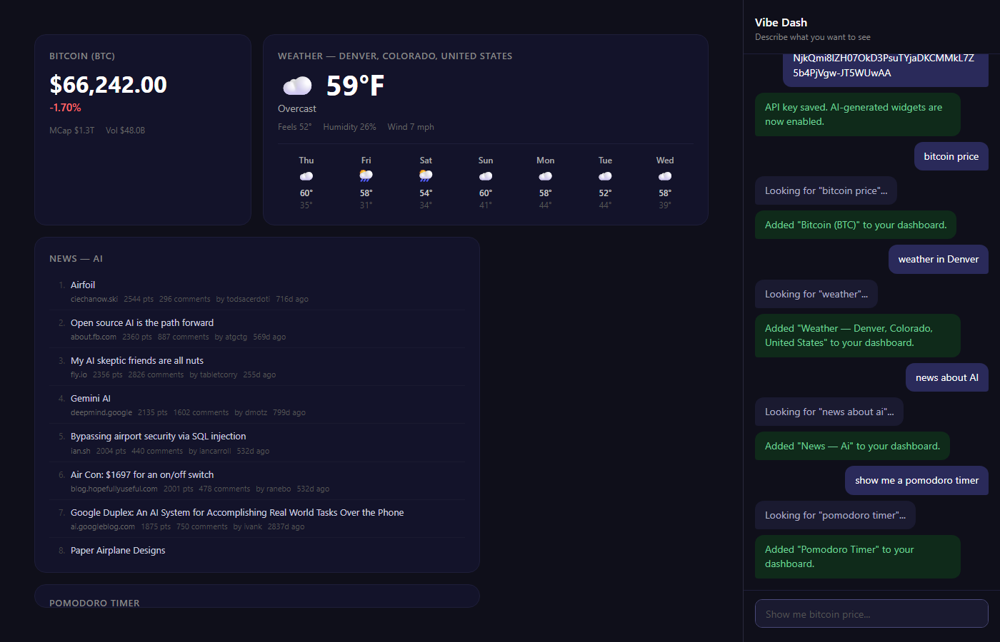

# Vibe Dash

A natural-language dashboard that turns plain English into live widgets. Type what you want to see — crypto prices, weather, news, or anything else — and it appears on your dashboard.

**[Try it live](https://leonardschuele.github.io/vibe-dash/)**



## How it works

Type into the chat panel. Vibe Dash parses your request, matches it to a data source, and renders a widget.

**Built-in sources** (no API key needed):

- **Crypto** — "bitcoin price", "show me ethereum" (CoinGecko API)
- **Weather** — "weather in Denver", "Tokyo forecast" (Open-Meteo API)
- **News** — "tech news", "news about AI" (HackerNews/Algolia API)

**AI-generated widgets** (requires OpenRouter API key):

Anything that doesn't match a built-in source falls through to an LLM that generates a self-contained HTML widget rendered in a sandboxed iframe. Ask for a pomodoro timer, a color palette, a unit converter — if you can describe it, the dashboard builds it.

## Setup

No build step. It's a static site — vanilla HTML, CSS, and ES modules.

To run locally, serve the directory over HTTP:

```sh
npx serve .
```

### API key for AI widgets

AI-generated widgets use [OpenRouter](https://openrouter.ai) to call Claude. Set your key in the chat:

```
/key sk-or-your-key-here
```

Other key commands:

```
/key              Show current key (masked)
/key clear        Remove stored key
```

The key is stored in `localStorage` and never leaves your browser except in direct API calls to OpenRouter.

## Widget management

```
bitcoin price              Create a crypto widget
weather in Tokyo           Create a weather widget
make it bigger             Resize the last widget
remove the weather widget  Remove by name
```

Widgets persist across page reloads. Data sources with refresh intervals (crypto, weather, news) auto-update; AI-generated widgets are static.

## Architecture

```
index.html                 Entry point
contracts.ts               Shared type definitions (no runtime code)
src/
  main.js                  Orchestrator — wires everything at boot
  event-bus.js             Pub/sub event bus
  chat-shell.js            Chat UI component
  intent-parser.js         Rule-based natural language parser
  source-router.js         Confidence-based routing + AI fallback
  widget-runtime.js        Widget state, refresh timers, persistence
  layout-engine.js         DOM rendering, CSS, widget templates
  persistence.js           localStorage read/write
  ai-generator.js          OpenRouter/Claude integration
  sources/
    crypto.js              CoinGecko price data
    weather.js             Open-Meteo forecast data
    news.js                HackerNews/Algolia headlines
```

Data flows linearly: **Chat → Parser → Router → Source → Runtime → Layout Engine**. All components communicate through the event bus. Components never throw across boundaries — errors are returned as values.

## Adding a data source

1. Define any new parameter keys in `contracts.ts`
2. Add extraction rules to `src/intent-parser.js`
3. Create `src/sources/your-source.js` implementing the `DataSource` interface (`id`, `match(intent) → confidence`, `resolve(intent) → Promise<result>`)
4. Register it in `src/main.js`
5. Add a render template in `src/layout-engine.js`

## License

MIT
